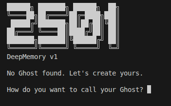

# 2501 DeepMemory


> *"Your Ghost travels with you. The Shell is just borrowed."*
> — inspired by Project 2501, Ghost in the Shell (Masamune Shirow)

**Your AI memory dies every time you switch models. 2501 fixes that.**

ChatGPT doesn't remember you when you move to Claude. Claude doesn't remember you when you try Llama. Every conversation starts from zero. Your memory belongs to their servers, not to you.

2501 is different. Your memory — your **Ghost** — lives encrypted in a folder you control (or on a USB stick in your pocket). Plug it into any machine with Ollama, and your AI is there. Switch models whenever you want. The Ghost stays.

---

## How it works

```
your Ghost (encrypted folder / USB)  +  Ollama (any model)  =  your personal AI
```

The Ghost is yours. The machine is just a Shell you borrow.

---

## Features (v1)

- **Persistent memory** — conversations are automatically distilled into a structured knowledge base between pauses
- **LLM-agnostic** — change model anytime, memory stays intact
- **Fully local** — nothing leaves your machine without your consent
- **Multimodal** — send PDFs, images, documents (with vision-capable models)
- **Transparent memory (xAI)** — see exactly what your AI remembers about you, edit it, delete it. No black boxes.
- **Ghost viewer** — Obsidian-style wiki of everything your AI knows, with live updates as it writes



---

## Wake / Sleep memory cycle

Inspired by how the human brain consolidates memory:

```
AWAKE   you talk to your Ghost
          ↓  pause detected (45 seconds)
        Ghost extracts key memories → writes structured wiki pages
          ↓  you can watch this happen in real time

SLEEP   (v2) deep consolidation → vector store + knowledge graph
```

---

## Quick start

```bash
# 1. Install Ollama → https://ollama.com
ollama pull llama3.2

# 2. Clone and install dependencies
git clone https://github.com/YOUR_USERNAME/2501-deepmemory
cd 2501-deepmemory
pip install -r requirements.txt

# 3. Run
python 2501.py
# OR use the automated launcher:
bash run.sh
```

Opens at **http://localhost:2501**

---

## 📂 Example Interaction

To get started and see how 2501 extracts memories, try uploading the included sample paper:
**`The Abstraction Fallacy.pdf`**

Ask your Ghost: *"Can you summarize this paper and tell me why abstraction can be a fallacy?"* 
Wait 45 seconds after the response to see your Ghost consolidate this knowledge into your personal Wiki.

---

## Using it on a USB stick

Copy the entire project folder to a USB stick. Your Ghost lives in `ghost/` inside that folder — encrypted, portable, yours.

On any machine with Python + Ollama installed:

```bash
bash run.sh
```

The launcher will automatically create a virtual environment and install dependencies if they are missing. The machine is just a terminal. Your Ghost is in your pocket.

---

## The Ghost format

Your Ghost is a set of encrypted markdown files. Under the encryption, it's plain text — readable by humans, editable, exportable, compatible with Obsidian/Logseq. Yours forever, independent of any app or service.

Built on [Karpathy's LLM Wiki pattern](https://github.com/karpathy) — a structured, interlinked knowledge base maintained by an AI.

```
ghost/
├── identity/      ← encrypted identity & key material
├── wiki/          ← your memories as markdown pages
│   ├── index.md
│   ├── log.md
│   └── [topic].md
└── sessions/      ← full conversation logs
```

---

## Roadmap

| Version | Focus |
|---------|-------|
| **v1** | Local Ghost, Ollama, wake-cycle memory, file/image ingestion |
| v2 | Sleep cycle — vector store + knowledge graph (RAG) |
| v3 | Cloud sync (optional), DID/blockchain identity, USB branding |

---

## Philosophy

Most AI products put the intelligence in the model.
**2501 puts the intelligence in the memory.**

A small local model with a rich Ghost outperforms a large cloud model with no memory of you. The Ghost is the product. The LLM is just the voice.

---

## Contributing

This is early. The concept is the foundation.
If you think persistent, portable, LLM-agnostic memory is the missing layer of personal AI — open an issue, start a discussion, send a PR.

**The Ghost belongs to everyone.**

---

## License

MIT
